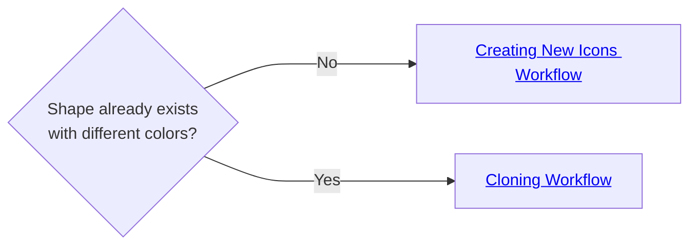
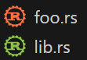

<h1>How to contribute</h1>

Glad you're here and interested in expanding this project 🎉 In order to make this work in the best possible way, there are hints and tips for successful contributors on this page. Please read everything carefully and your contributions will be valuable and gratefully received.

<!-- TOC -->

- [Icon Requests](#icon-requests)
- [Add new icons](#add-new-icons)
- [How-To's](#how-tos)
  - [Create icon as SVG](#create-icon-as-svg)
  - [Use Material Design colors](#material-design-colors)
  - [Design folder icons](#design-folder-icons)
  - [Icon spacing](#icon-spacing)
  - [Icons for color themes](#icons-for-color-themes)
  - [Unique assignment to file and folder names](#icon-assignments)
  - [Create icon packs](#icon-packs)
  - [Designing Pixel Perfect Icons](#pixel-perfect-icons)
  - [Cloning existing icons](#icon-cloning)
- [Add translations](#add-translations)
- [Update API](#update-api)

<!-- /TOC -->

## Icon Requests

A new icon for a file name, file extension or folder name is needed? Please create an issue and follow the rules below:

- Describe if a file and/or folder icon is needed
- List the file names/endings and folder names
- Mention some graphic ideas (how can the icon look like)
- Show an example image of the icon or provide a link to the related website

## Add new icons

It is always welcome to add new icons to the extension. However, there are a few things you should take into account so that the icon can be included in the extension.



### Creating New Icons Workflow

**Checklist**

1. [ ] Create icon as SVG ([how to](#create-icon-as-svg))
2. [ ] Icon color fits to Material Design ([how to](#material-design-colors))
3. [ ] SVG has some space around the icon ([how to](#spacing))
4. [ ] Unique assignment to file and folder names ([how to](#icon-assignments))
5. [ ] Provide separate icons for color themes if necessary ([how to](#icons-for-color-themes))

### Cloning Workflow

There are times when we just need to create a variant of an existing icon.

For example, we might want to create an icon using the shape of the `typescript` icon, but we want it to be green and associated with the `library.ts` file name. In that case, we don't need to create a new svg. This can be done by configuration.

**Checklist**

1. [ ] Clone the existing icon adjusting its color ([how to](#icon-cloning))

## How tos

<h3 id="create-icon-as-svg">Create icon as SVG</h3>

These free tools are recommended to create or edit new SVG icons:

- [Inkscape](https://inkscape.org/en/) is a free, open source SVG editor
- There are tools available to convert PNG/JPG images to SVG - [Autotracer.org](https://autotracer.org) and [Vectorizer.io](https://vectorizer.io) are two examples.

> **Note**
> It's important to produce fully _vectorized_ graphic (don't include a base64 image string in the svg).

When you create a folder icon, please keep in mind that two SVG files are needed here: one that represents the folder closed and another that represents it open.

```
📁 folder-example.svg
📂 folder-example-open.svg
```

Of course, there is also the possibility to add existing SVGs. Mostly, however, the color has to be adjusted or the styling has to be changed, so that the other points from the above checklist are also fulfilled.

<h4>Known icon sources</h4>

- [Material Design Icons](https://materialdesignicons.com/)

<h3 id="material-design-colors">Use Material Design colors</h3>

An important success factor of this icon extension is the fact that all colors fit together harmoniously. This is due to the fact that all icons exist only from colors of the [Material Design color palette](https://material.io/design/color/the-color-system.html#tools-for-picking-colors). This creates nice contrasts and the icons are easily recognizable.

Now it often happens that many programming languages already have icons with their own colors. To find the matching color from the Material Design color palette based on a known color, there is the [Material Color Converter](https://pkief.github.io/material-color-converter/). With its help any color can be converted into a Material Design color.

You can check if your icon fits the Material Design color palette by running the following command:

```sh
npm run check-colors <path/to/svg>
```

Continue reading [here](#design-folder-icons) to find out about colors for the folder icons.

| ✅                                                                | ❌                                                                    |
| ----------------------------------------------------------------- | --------------------------------------------------------------------- |
|  |  |

<h3 id="design-folder-icons">Design folder icons</h3>

When designing folder icons there are also a few points to consider. A folder icon always consists of two icons - the folder in the background and a motive in the foreground:


For the motive, only colors from the second row in the [color palette](https://pkief.com/material-color-converter/) are allowed. For the background choose a slightly darker hue (mostly in rows 4-6 in the palette).


This uniform color selection makes the folder icons look more consistent and fit well together. This ensures a good quality of the icons.

| ✅                                                                                   | ❌                                                                                 |
| ------------------------------------------------------------------------------------ | ---------------------------------------------------------------------------------- |
|  |  |

<h3 id="icon-spacing">Icon spacing</h3>

All icons have a small distance to the edge. This way they don't seem so pressed together and have a little more air. It is not defined how much margin you have to leave them, because this is always a bit different. Just make sure that there is a space to the outside.

| ✅                                                                | ❌                                                                   |
| ----------------------------------------------------------------- | -------------------------------------------------------------------- |
|  |  |

<h3 id="icon-assignments">Assignment to file and folder names and language ids</h3>

Icons are assigned to file names, folder names or registered languages of VS Code in these files:

- [fileIcons.ts](src/icons/fileIcons.ts)
- [folderIcons.ts](src/icons/folderIcons.ts)
- [languageIcons.ts](src/icons/languageIcons.ts)

Be careful when assigning icons to files and folders, as not everyone expects a file name to have a special icon based on a framework that is not used by them. A solution for this can be the usage of [Language icon definitions](#language-icons) or [icon packs](#icon-packs).

#### File icons

Here's an example of how the SVG icon 'sample.svg' is assigned to file names and extensions:

```ts
{
  name: 'sample',
  fileNames: ['sample.js', 'sample.ts', 'sample.html'],
  fileExtensions: ['sample'],
}
```

This will apply an icon for the files 'sample.js', 'sample.ts' and 'sample.html' as well as for files that end with 'sample' like 'another-file.sample'.

##### Apply patterns

It is also possible to use patterns for file names and extensions. This is useful when you want to assign an icon to a group of files that have a common pattern. Here's an example:

```ts
{
  name: 'graphql',
  patterns: {
    graphql: FileNamePattern.Ecmascript,
  },
}
```

In case of this example the generated file names are "graphql.js", "graphql.mjs", "graphql.cjs", "graphql.ts", "graphql.mts" and "graphql.cts". The pattern is defined in the [patterns.ts](src/icons/patterns/patterns.ts) file.

Available patterns are right now:

| Pattern       | File extensions                                                                                            |
| ------------- | ---------------------------------------------------------------------------------------------------------- |
| ecmascript    | `js`, `mjs`, `cjs`, `ts`, `mts`, `cts`                                                                     |
| configuration | `json`, `jsonc`, `json5`, `yaml`, `yml`, `toml`                                                            |
| nodeEcosystem | Combination of ecmascript and configuration patterns                                                       |
| cosmiconfig   | `.${fileName}rc`, `.config/${fileName}rc` and `${fileName}.config` with file extensions of `nodeEcosystem` |

#### Folder icons

Here's an example of how a folder icon can be assigned to folder icons:

```ts
{
  name: 'folder-sample',
  folderNames: ['sample', 'samples'],
}
```

This will apply a folder icon for the folders 'sample' and 'samples'.

> **Note**
> The tool automatically creates generic "wildcard" variants of these folders, so only assign the base names.

#### Language icons

Here's an example of how a file icon can be assigned to language ids:

```ts
{ icon: { name: 'sample' }, ids: ['css'] },
```

This will apply the sample.svg icon to all files which could be associated by VS Code with the CSS programming language.

<h3 id="icons-for-color-themes">Icons for color themes</h3>

VS Code can be customized so that the background color is either light or dark. This must also be considered for the icons, because a dark icon on a dark background does not provide the necessary contrast it needs to be recognizable.

| ✅                                                                    | ❌                                                                       |
| --------------------------------------------------------------------- | ------------------------------------------------------------------------ |
|  |  |

Preferably, the icon has a color that looks good on both backgrounds. If this is ever not possible because it would otherwise no longer match the icon's branding, different icons can be provided for the respective color scheme.

This separation is possible by using the `light` attribute in the icon configuration:

```ts
{ name: 'sample', fileNames: ['sample.txt'], light: true },
```

If the `light` attribute is set to `true`, it is necessary to provide two icon files:

- sample.svg
- sample_light.svg

The icon with the ending '\_light' will be automatically chosen when VS Code is using a light background color. So the icon should then look a bit darker to have a good contrast on the lighter background.

In addition, there's also the possibility to provide a separate icon for high contrast backgrounds like this:

```ts
{ name: 'sample', fileNames: ['sample.txt'], highContrast: true },
```

If the `highContrast` attribute is set to `true`, it is necessary to provide two icon files:

- sample.svg
- sample_highContrast.svg

<h3 id="icon-packs">Create icon packs</h3>

Sometimes it can happen that certain files or folders need an icon, but you cannot avoid that there could be different icons for them. An icon pack can bundle different icons and as an end user you can decide which icons to display.

Here's an example that shows how two icons can be assigned to the same file name by using icon packs:

```ts
{
  name: 'sample-blue',
  fileNames: ['sample.txt'],
  enabledFor: [IconPack.Blue],
},
{
  name: 'sample-red',
  fileNames: ['sample.txt'],
  enabledFor: [IconPack.Red],
}
```

To create an icon pack, the following steps have to be completed:

1. Add the name of the icon pack to the enum in [iconPack.ts](src/models/icons/iconPack.ts)
2. Add translations to the package.nls.\*.json files under the section `configuration.activeIconPack` (at least to [package.nls.json](package.nls.json), the English translation file)
3. Adjust [package.json](package.json) under `configuration.properties.material-icon-theme.activeIconPack`
4. Use the icon pack inside the [fileIcons.ts](src/icons/fileIcons.ts),[folderIcons.ts](src/icons/folderIcons.ts) or [languageIcons.ts](src/icons/languageIcons.ts) files in the `enabledFor` attribute

<h3 id="pixel-perfect-icons">Designing Pixel-Perfect Icons</h3>

At 100% zoom, VS Code displays icons at 16x16 pixels. This means that ideally, the icons should be designed in a way that they look good at this size.

A known issue is that the icons can appear blurry after resizing them, even to the point where they are no longer easily recognizable, depending on the case.

To avoid blurry icons, it is recommended to design them using a 16x16 grid and trying to align the edges of the icon to it. This will help ensure that the icons look sharp and clear, even at smaller sizes.


<h4 id="pixel-perfect-tips">Tips for Designing Pixel-Perfect Icons</h4>

The following are some tips to help you design nice and sharp-looking icons. These tips are not rules but rather guidelines to help you achieve the best results possible:

- **Use a grid**: This is the most important tip. Try to use a 16x16 grid to design the icons and snap the edges of the icon to the grid. Blurriness is often caused by misalignment of the edges and vertices, resulting in the icon trying to fit a pixel in between two pixels. As this is physically impossible, the engine will create two pixels with different opacity to simulate the in-between pixel, causing the blurriness. When a path is aligned to the grid, each pixel will be a solid color, and the icon will look sharp.

  The following example illustrates an icon with its paths aligned to a 16x16 grid:

  

  On the other hand, this other example illustrates an icon with its paths not aligned to a 16x16 grid:

  

  Here is a comparison of both icons rendered at 16px:

  

  As you can see, the misaligned icon (left) has blurry edges with "ghost pixels" that attempt to simulate "half a pixel". Additionally, the suitcase motif in it is slightly harder to recognize. On the other hand, the aligned icon (right) looks sharper and clearer.

  So, even though the difference between the two icons was subtle, the impact on the final result is quite significant.

- **Decimals are not your friends**: Related to the previous tip, when designing icons, it's important to try to avoid using decimal values for the positions of the vertices. This is because, as previously mentioned, pixels are square, and there's no such thing as a fractionated pixel. If you keep the vertices aligned to the grid, it will be easier to avoid decimal coordinates. In short, try to keep the vertices on whole numbers.

- **Sometimes less is more**: Detail is valuable, but attempting to incorporate too much detail in 16 pixels or less can pose a significant challenge. It might even be counterproductive, resulting in an icon that is difficult to recognize. Icons are primarily about communicating a concept. To effectively communicate a concept, it must be easily recognizable.

  Let's consider the following example:

  

  The icon is visually appealing, but it has some issues: the trunk, the tail and the negative space separating the ear from the body are too thin. Additionally, the eye is too small, and the shapes, in general, are somewhat complex. While this icon would look great if rendered at 24, 32, or 64 pixels, at 16 pixels, we lack sufficient resolution to effectively convey the concept.

  Now, let's explore a minimalistic approach to communicating the same concept:

  | Concept                                                             | Result                                                                |
  | ------------------------------------------------------------------- | --------------------------------------------------------------------- |
  |  |  |

  Indeed, the minimalistic version may lack the level of detail present in the first icon, particularly when viewed at a larger size. However, on the other hand, we are still effectively communicating the concept. It's unmistakably an elephant. Furthermore, all edges and paths are aligned to the grid.

  Now, let's examine both icons when rendered at 16px:

  

- **Curves vs straight lines**: Let's face it, pixels are square, there's nothing we can do about it. And since pixels are square, drawing a curve actually involves drawing a series of... squares. Consequently, when rendering a curve, we're essentially asking the display to render a fraction of a pixel, which is impossible. As a result, curves tend to appear blurry. This is normal. However, it's perfectly fine to use curves, circles, and rounded edges in your icons. Just keep in mind these limitations if you're wondering why your icon doesn't look as sharp as you'd like.

<h3 id="icon-cloning">Cloning existing icons</h3>

The extension allows you to clone existing icons and adjust their colors through configuration. This enables you to create new color variants of an existing icon without having to create new SVG files.

As we mentioned previously, icons are assigned to filenames, file extensions, and folder names in the following files:

- [fileIcons.ts](src/icons/fileIcons.ts)
- [folderIcons.ts](src/icons/folderIcons.ts)

The following example demonstrates how the shapes of the `rust` file icon can be reused to create a clone of it, utilizing different colors and associated with different file names than the original icon.

```ts
{
  name: 'rust-library',
  fileNames: ['lib.rs'],
  light: true, // needed if a `lightColor` is provided
  clone: {
    base: 'rust',
    color: 'green-400',
    lightColor: 'green-700', // optional
  },
},
```

This will generate a new icon assignment for the file name `lib.rs` with the same shape as the already existing `rust` icon but with a green color instead. Additionally, it will create a light theme variant of the icon with a darker green color for better contrast when using a light theme.

That's it. We don't need to create a new SVG file. The extension will automatically adjust the colors of the existing icon.



The same technique can be applied to folder icons by using the `clone` attribute in the folder icon configuration.

You might have noticed that we are using aliases for the colors. These aliases correspond to the Material Design color palette.

You can find a list of all available color aliases in the [materialPalette.ts](./src/icons/generator/clones/utils/color/materialPalette.ts) file.

#### Preventing recoloring in cloned icons

When cloning icons, recoloring works by replacing each color attribute in each path/shape of the SVG with a new color, which is determined by the selected color in the configuration.

However, there are cases where you might want to prevent certain parts of the icon from being recolored.

Let's see an example:


In this example, we have the `folder-gitlab` folder icon. If we were to clone it, we might want to prevent recoloring from happening over the gitlab logo and only allow recoloring of the folder shape itself.

To do this, we need to set the attribute `data-mit-no-recolor="true"` to the paths, shapes, or groups we do not want to be recolored.

```svg
<svg ...>
  <path d="M13...Z" style="fill: #757575"/>
  <g data-mit-no-recolor="true"> <!-- prevent recolor of the gitlab logo -->
    <path d="M31...Z" style="fill: #e53935"/>
    <path d="M31...Z" style="fill: #ef6c00"/>
    <path d="M19...Z" style="fill: #f9a825"/>
    <path d="M17...Z" style="fill: #ef6c00"/>
  </g>
</svg>
```

Now if we create a clone of this icon, the paths, shapes, or groups marked with `data-mit-no-recolor="true"` will retain their original colors. Recoloring will only affect paths not marked with this attribute.

```typescript
{ name: 'folder-gitlab', folderNames: ['gitlab'] },
{
  name: 'folder-green-gitlab',
  clone: {
    base: 'folder-gitlab',
    color: 'blue-300'
  },
}
```

Will result in:


## Add translations

This project offers translations into different languages. If you notice an error here, please help to fix it. You can do this as follows:

- Create or edit the translations in the `src/i18n` directory.
- Create or edit the `package.nls.*.json` files in the root folder

## Debug extension locally

This icon extension consists not only of icons but also brings some code. This is necessary to simplify various things and enable multiple functionalities. If you want to change something here, the following steps are to be considered:

1. Install [Bun](https://bun.sh/docs/installation) on your machine
2. Install dependencies with `bun install`
3. Open project with VS Code
4. Install required [VS Code extensions](.vscode/extensions.json)
5. Press `F5` or run `Launch Extension` in the debug window
6. Run tests with `bun test`

You will find more information about the official extension API in the [extension guides of VS Code](https://code.visualstudio.com/api/extension-guides/file-icon-theme).
