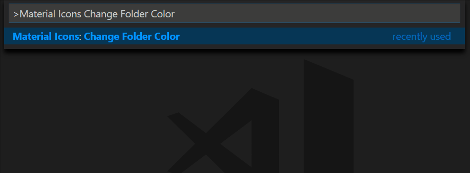

# Material Icon Theme

[](https://marketplace.visualstudio.com/items?itemName=PKief.material-icon-theme)
[](https://marketplace.visualstudio.com/items?itemName=PKief.material-icon-theme)
[](https://marketplace.visualstudio.com/items?itemName=PKief.material-icon-theme)
[](https://travis-ci.org/PKief/vscode-material-icon-theme)

The Material Icon Theme provides lots of icons based on Material Design for Visual Studio Code.

### File icons


### Folder icons


#### Customize folder icons

You can change the design of the folder icons:


or via user settings:

```json
"material-icon-theme.folders.theme": "specific"
```

#### Customize folder color

You can change the color of the folder icons:



or via user settings:

```json
"material-icon-theme.folders.color": "#ef5350",
```

## Custom icon associations

You can customize the icon associations directly in the user settings.

### File associations

`*.[extension]` associations set the file extension mapping. E.g. every file that ends with `.ts` will have a custom icon. If there's no `*` before the association it will configured as filename.

```json
"material-icon-theme.files.associations": {
    "*.ts": "typescript",
    "fileName.ts": "angular"
}
```

### Folder associations

The following configuration can customize the folder icons. It is also possible to overwrite existing associations and create nice combinations with other folder icon colors.

```json
"material-icon-theme.folders.associations": {
    "source": "src",
    "out": "dist"
}
```

#### Possible combinations


## One-click activation
After installation or update you can click on the 'Activate'-button to activate the icon theme, if you haven't already. The icons will be visible immediately.


## Commands
Press `Ctrl-Shift-P` to open the command palette and type `Material Icons`.


- **Change Folder Icons**: Change the design of the folder icons.

- **Configure Icon Packs**: Select an icon pack that enables additional icons.

- **Hide the arrows before the folder icons**: Hides the arrows on the left of the folder icons.

- **Restore Default Configuration**: Reset the default configurations of the icon theme.

- **Activate Icon Theme**: Activate the icon theme.

## Icon sources
* [Material Design Icons](https://materialdesignicons.com/)
* official icons

## How to contribute

Read the [contribution guidelines](https://github.com/PKief/vscode-material-icon-theme/blob/master/CONTRIBUTING.md).

If you have some questions or icon requests open a [new issue](https://github.com/PKief/vscode-material-icon-theme/issues) on Github.

## Follow me
- [Twitter](https://twitter.com/PhilippKief)
- [Github](https://github.com/PKief)