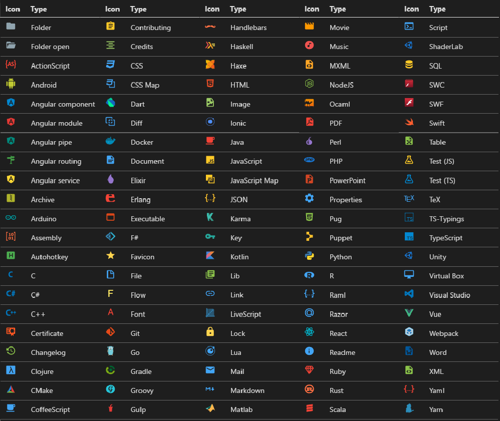

# Material Icon Theme

The Material Icon Theme provides icons for Visual Studio Code based on Material Design. You can customize the icon theme by using the commands or configurations of this icon set.

<!--

-->

## Icon sources
* [https://design.google.com/icons/](https://design.google.com/icons/)
* [https://materialdesignicons.com/](https://materialdesignicons.com/)
* self made

## How to contribute

Read the [contribution guidelines](https://github.com/PKief/vscode-extension-material-icon-theme/blob/master/CONTRIBUTING.md).

If you have some questions or icon requests open a [new issue](https://github.com/PKief/vscode-extension-material-icon-theme/issues/new) on Github.

## Follow me
- [Twitter](https://twitter.com/PhilippKief)
- [Github](https://github.com/PKief)