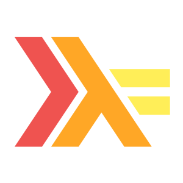
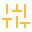
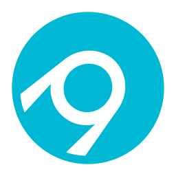
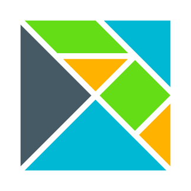
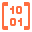
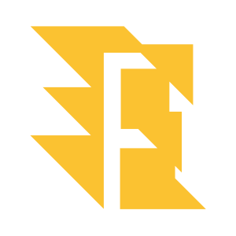
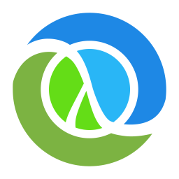
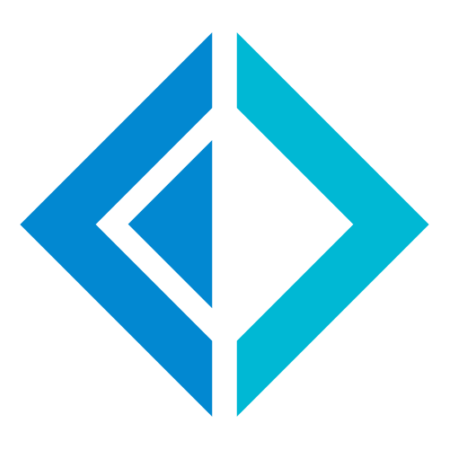
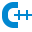

|Icon|Type|Icon|Type|Icon|Type|Icon|Type|Icon|Type|
|---|---|---|---|---|---|---|---|---|---|
||Actionscript||Css-map||Handlebars||Nodejs||Swc|
||Android||Css||Haskell||Nunjucks||Swift|
||Angular-component||Dart||Haxe||Ocaml||Table|
||Angular-guard||Database||Html||Pdf||Test-js|
||Angular-pipe||Diff||Image||Perl||Test-ts|
||Angular-routing||Docker||Ionic||Php||Tex|
||Angular-service||Document||Java||Powerpoint||Travis|
||Angular||Elixir||Javascript-map||Protractor||Tune|
||Appveyor||Elm||Javascript||Pug||Twig|
||Arduino||Email||Json||Puppet||Typescript-def|
||Assembly||Erlang||Julia||Purescript||Typescript|
||Autohotkey||Exe||Karma||Python||Unity|
||Bithound||Favicon||Key||R||Url|
||Bucklescript||File||Kotlin||Raml||Verilog|
||C-lang||Flash||Lib||Razor||Virtual|
||Certificate||Flow||Livescript||React||Visualstudio|
||Changelog||Folder-open||Lock||Readme||Vue|
||Clojure||Folder||Lua||Reason||Webpack|
||Cmake||Font||Markdown||Ruby||Wolframlanguage|
||Coffee||Fsharp||Mathematica||Rust||Word|
||Console||Git||Matlab||Sass||Xaml|
||Contributing||Gopher||Merlin||Scala||Xml|
||Cpp||Gradle||Movie||Settings||Yaml|
||Credits||Groovy||Music||Smarty||Yarn|
||Csharp||Gulp||Mxml||Stylus||Zip|
