|Icon|Type|Icon|Type|Icon|Type|Icon|Type|Icon|Type|
|---|---|---|---|---|---|---|---|---|---|
||Actionscript|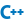|Cpp||Groovy||Merlin|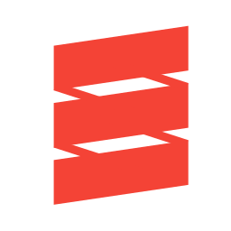|Scala|
||Android||Credits||Gulp||Movie||Settings|
||Angular-component||Csharp|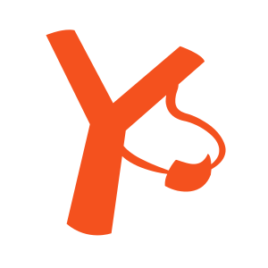|Haml||Music||Smarty|
||Angular-directive||Css-map||Handlebars||Mxml|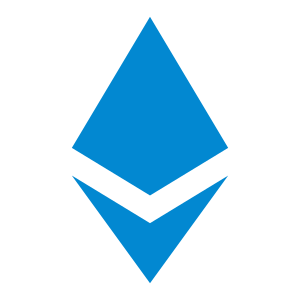|Solidity|
||Angular-guard|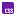|Css|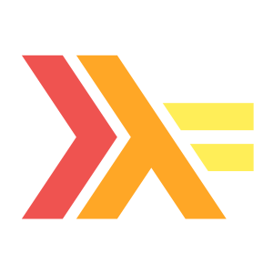|Haskell||Nim|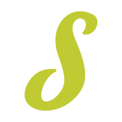|Stylus|
||Angular-pipe||Cucumber||Haxe||Nodejs||Swc|
||Angular-routing||Dart||Heroku||Nunjucks||Swift|
||Angular-service||Database||Html||Ocaml||Table|
||Angular||Diff||Image||Pdf||Terraform|
||Apiblueprint||Docker|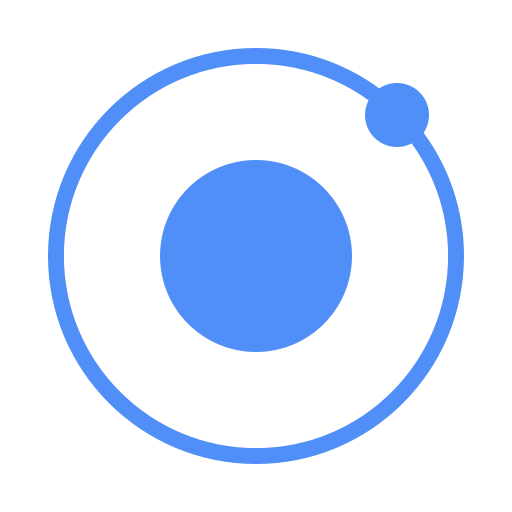|Ionic||Perl||Test-js|
||Applescript||Document||Java||Php||Test-ts|
||Appveyor||Editorconfig||Javascript-map||Powerpoint||Tex|
||Arduino||Elixir||Javascript||Powershell|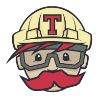|Travis|
||Assembly|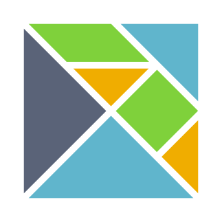|Elm||Json||Protractor|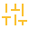|Tune|
||Autohotkey||Email||Julia||Pug||Twig|
||Autoit||Erlang||Karma||Puppet|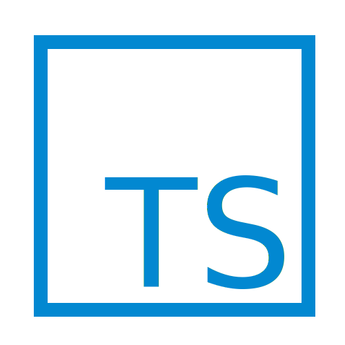|Typescript-def|
||Babel||Exe||Key||Purescript|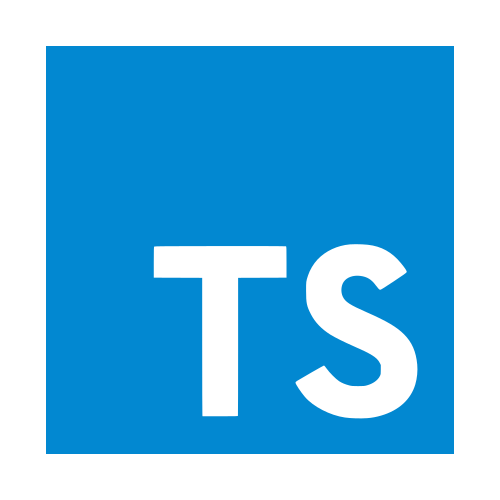|Typescript|
|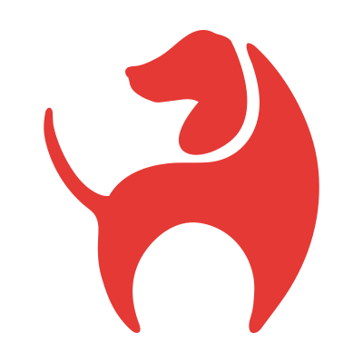|Bithound||Favicon|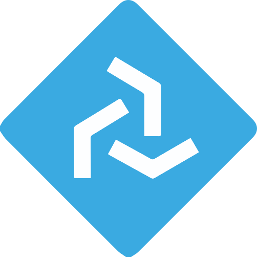|Kl||Python||Unity|
|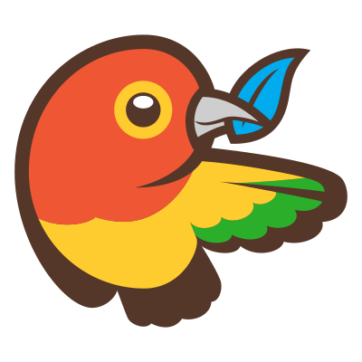|Bower||File||Kotlin||R||Url|
||Bucklescript||Flash|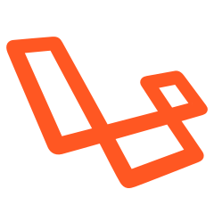|Laravel||Raml||Verilog|
||C-lang|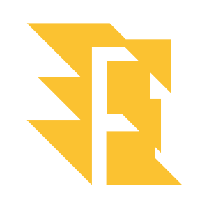|Flow||Less||Razor||Vfl|
||Cake||Font||Lib|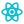|React||Virtual|
||Certificate|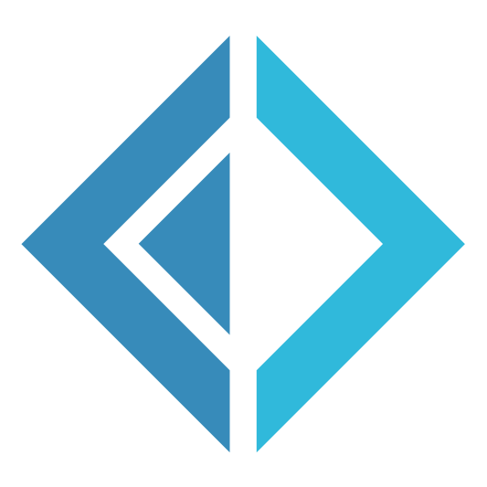|Fsharp||Livescript||Readme||Visualstudio|
||Changelog||Fusebox||Lock||Reason||Vue|
|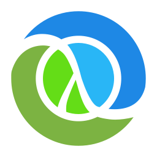|Clojure||Git||Lua||Riot||Webpack|
||Cmake|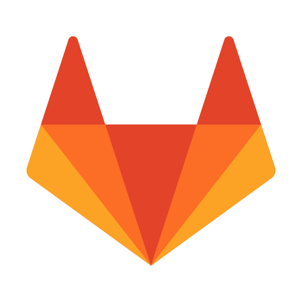|Gitlab||Markdown||Robot||Wolframlanguage|
||Coffee||Gopher||Markojs||Ruby||Word|
||Console||Gradle||Mathematica||Rust||Xaml|
||Contributing|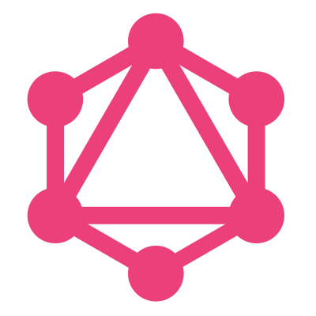|Graphql||Matlab|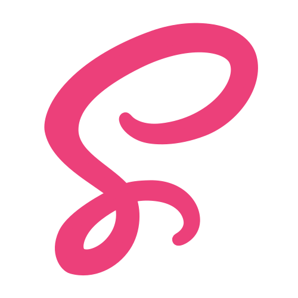|Sass||Xml|
