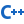
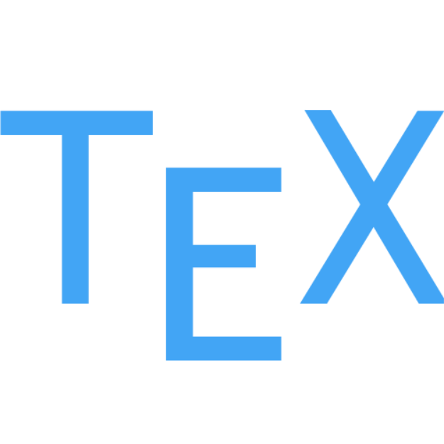
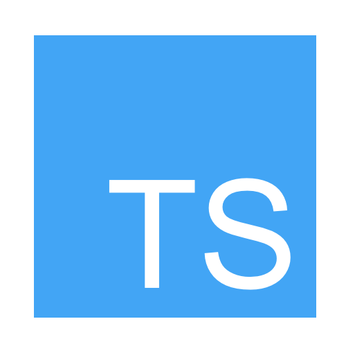

|Icon|Type|
|---|---|
||Folder|
||Folder outline|
||ActionScript|
||Android|
||Angular|
||Archive|
||Arduino|
||C|
||C++|
||C#|
||Certificate|
||Changelog|
||Clojure|
||CMake|
||Contributing|
||Credits|
||CSS|
||Dart|
||Docker|
||Executable|
||F#|
||File|
||Flow|
||Font|
||Git|
||Go|
||Gradle|
||Groovy|
||Gulp|
||Haskell|
||HTML|
||Image|
||Ionic|
||Jade / Pug|
||Java|
||JavaScript|
||JSON|
||Key|
||Kotlin|
||Lib|
||Link|
||Lua|
||Mail|
||Markdown|
||Movie|
||Music|
||MXML|
||NodeJS|
||PDF|
||PHP|
||PowerPoint|
||Properties|
||Python|
||R|
||Raml|
||React|
||Readme|
||Ruby|
||Rust|
||Script|
||SQL|
||SWC|
||SWF|
||Swift|
||Table|
||TeX|
||TS-Typings|
||TypeScript|
||Virtual Box|
||Visual Studio|
||Vue|
||Webpack|
||Word|
||XML|
||Yaml|
||Yarn|